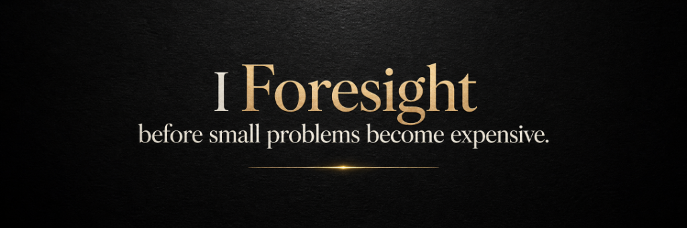
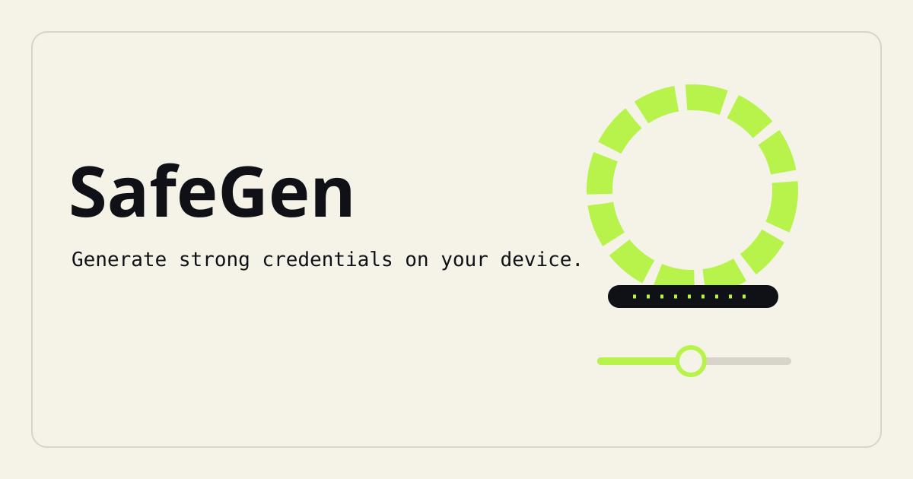
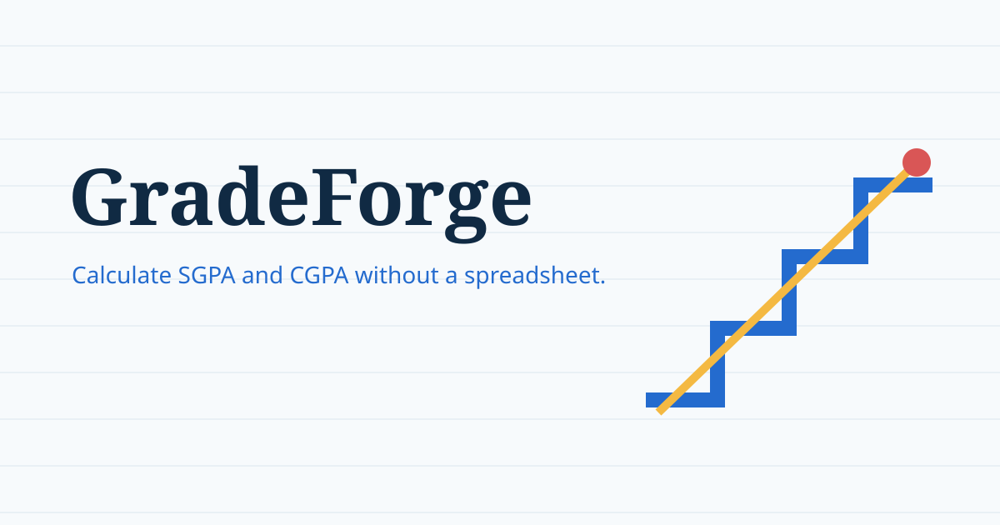
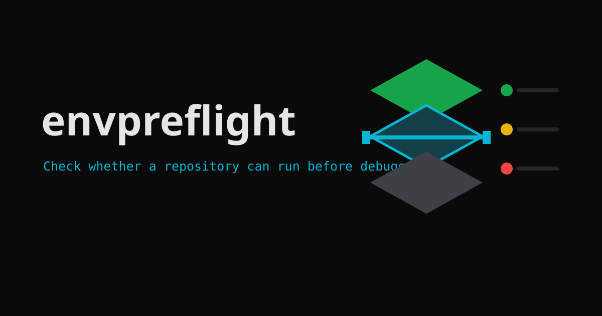
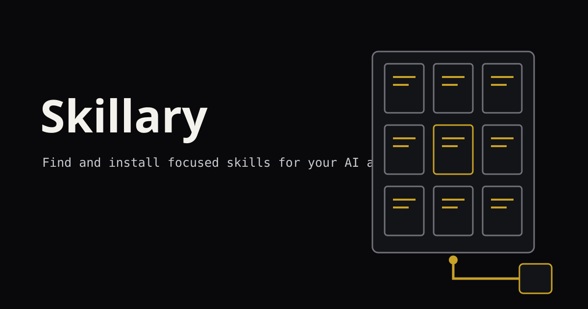
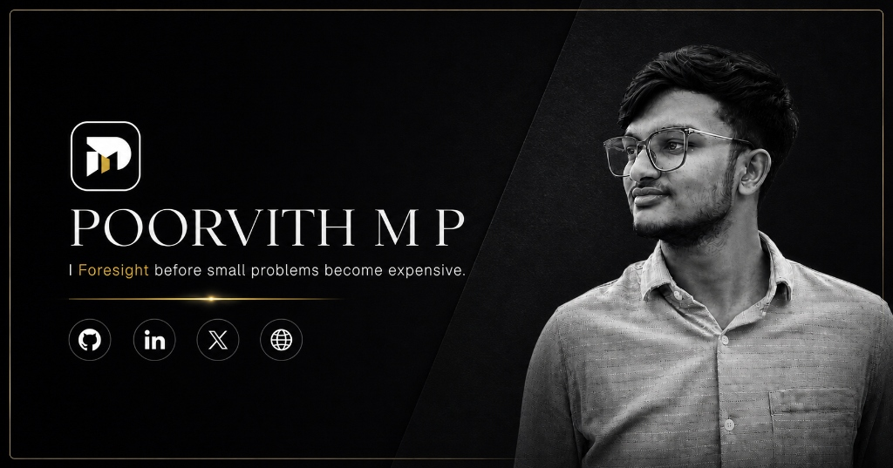
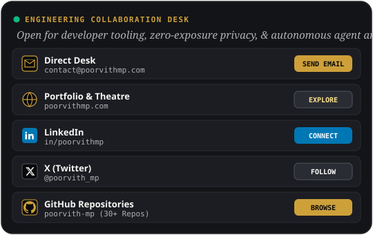

<!-- Top Banner: Foresight Wide -->

  

<!-- Logo & Core Profile Identity -->

# POORVITH M P

### <i>I Foresight before small problems become expensive.</i>

  <strong>Tools Architect • AI Agent Systems • Local-First & Privacy Engineering</strong>
   
  Hassan, Karnataka, India

<!-- Live Animated System Indicator -->

  

<!-- Identity Action Badges -->

  
  
  
  
  

---

## 🏛️ About Me & The Foresight Principle

I notice the friction people learn to tolerate, turn it into a focused tool, and keep the engineering decisions visible from first check to working proof.

Most software failures don't happen because of complex math — they happen because small warning signs were ignored: a credential pasted into an LLM prompt, a missing environment variable crashing a dev container, or semester grade calculations lost in rigid spreadsheets. 

I build browser-local utilities, developer tools, and modular AI agent systems that solve these exact points of friction before they turn into costly emergencies.

 

<table>
<tr>
<td width="25%" align="center">
  <strong>🛡️ Foresight First</strong> 
  Catching leaks, conflicts, and decay before staging or production
</td>
<td width="25%" align="center">
  <strong>🔒 Zero-Exposure Privacy</strong> 
  100% browser-local cryptography and offline-capable CLIs
</td>
<td width="25%" align="center">
  <strong>⚡ Useful Before Impressive</strong> 
  Sub-3-second runtimes, zero-config setups, and honest limits
</td>
<td width="25%" align="center">
  <strong>🔍 Visible Trade-Offs</strong> 
  Open documentation, verified benchmarks, and zero telemetry traps
</td>
</tr>
</table>

---

## 🚀 My Contributions

<table width="100%">
<tr>
<td width="50%" valign="top">

<!-- AIScrubber Card (Row 1, Left) -->

###  [AIScrubber](https://github.com/poorvith-mp/aiscrubber)
> **Zero-exposure browser privacy desk, CLI, and Model Context Protocol (MCP) server.**

- **The Problem:** Developers paste credentials, DB strings, and logs into frontier LLMs. Once sent to frontier models or public issue trackers, a secret cannot be un-sent.
- **The Solution:** Operates 5 client-side engines: text credential scrubber (8 detector classes + regex), zero-exposure prompt roundtrip with `.aiscrub.json` reconstruction key, zero-width Unicode watermark remover, C2PA EXIF/metadata wiper, and canvas redactor.
- **Tech Stack:** React 19 · TypeScript · Web Crypto API · Vite · Tailwind CSS · MCP Server · Node CLI

  
  

<strong>View architectural highlights</strong>

- 100% in-browser Web Crypto execution with zero network telemetry
- Claude & LLM invisible watermark remover (`\u200B`, `\u200C`, `\u200D`, `\uFEFF`, `\u2060`)
- Terminal batch execution via `npx aiscrubber`
- Native MCP server integration for Claude Desktop, Cursor, and Codex

</td>
<td width="50%" valign="top">

<!-- SafeGen Card (Row 1, Right) -->

###  [SafeGen](https://github.com/poorvith-mp/safegen)
> **Browser-local cryptographic credential, passphrase, and pattern generator.**

- **The Problem:** Online password generators transmit generated secrets across networks or rely on biased pseudo-random implementations.
- **The Solution:** Uses browser `crypto.getRandomValues()` with rejection sampling to eliminate modulo bias. Provides 4 modes: Random Password, Memorable Passphrase, Numeric PIN, and Custom Pattern with live bit-entropy calculation.
- **Tech Stack:** React 19 · TypeScript · Web Crypto API · Vite · Tailwind CSS v4 · GSAP

  
  

<strong>View architectural highlights</strong>

- Cryptographic randomness via Web Crypto API with zero server calls
- Live bit-entropy scoring and offline brute-force crack time models
- Local-only searchable copy desk up to 50 items with 1-click purge
- Fully responsive tactile interface with GSAP micro-interactions

</td>
</tr>
<tr>
<td width="50%" valign="top">

<!-- GradeForge Card (Row 2, Left) -->

###  [GradeForge](https://github.com/poorvith-mp/gradeforge)
> **Credit-weighted semester GPA engine & Target What-If degree planner.**

- **The Problem:** University grading scales vary widely. Ad-filled online calculators fail on custom credits, multi-semester weighting, and forward-looking GPA target forecasting.
- **The Solution:** Preloaded with university presets (VTU CBCS, Anna University, Mumbai University, KTU, JNTU, US 4.0) plus a custom scale builder. Includes a Target CGPA What-If planner calculating exact required semester GPAs.
- **Tech Stack:** React 18 · TypeScript · Vite · Tailwind CSS · LocalStorage Persistence

  
  

<strong>View architectural highlights</strong>

- Multi-semester credit-weighted SGPA and cumulative CGPA calculation
- Target CGPA 'What-If' planner for future semester planning
- CSV data export, JSON backup, and clean printable transcript renderer
- 100% offline browser storage with zero account signups

</td>
<td width="50%" valign="top">

<!-- EnvPreflight Card (Row 2, Right) -->

###  [EnvPreflight](https://github.com/poorvith-mp/envpreflight)
> **Sub-3-second local runtime, service, and environment readiness auditor.**

- **The Problem:** Developers clone a repository and hit cryptic runtime mismatches, missing `.env` variables, stopped database daemons, or port collisions.
- **The Solution:** Automatically inspects project manifests (`.nvmrc`, `package.json`, `pyproject.toml`, `go.mod`, `docker-compose.yml`, `.env.example`) and generates single-line copyable fixes.
- **Tech Stack:** TypeScript · Node.js · pnpm Workspaces · tsup · Vitest · MCP Protocol · VS Code Extension

  
  

<strong>View architectural highlights</strong>

- Multi-runtime validation for Node.js, Python, Go, and Rust
- Background daemon checks: Postgres (5432), Redis (6379), MySQL (3306), MongoDB (27017), Docker
- Strict zero-leakage `.env` variable key auditor (secret values are never read or logged)
- Model Context Protocol (MCP) server for Claude Code and Cursor agents

</td>
</tr>
<tr>
<td width="50%" valign="top">

<!-- Skillary Card (Row 3, Left) -->

###  [Skillary](https://github.com/poorvith-mp/skillary)
> **The Universal AI Agent Skills Ecosystem — 315 modular agent instructions.**

- **The Problem:** AI coding agents lack structured, deterministic domain knowledge, resulting in shallow answers and repetitive manual prompting across projects.
- **The Solution:** A standardized repository index of 315 agent skills across 12 domain packages compatible with Claude Code, OpenAI Codex, Cursor, and Gemini CLI. Adheres strictly to the Agent Skills Specification.
- **Tech Stack:** Markdown Architecture · Agent Skills Spec · Progressive Execution Index · pnpm Workspaces

  
  

<strong>View architectural highlights</strong>

- 12 Categorized Domain Packages: Developer, Marketing, Design, Business, Finance, Writing, and more
- Direct terminal installation via `npx skills add poorvith-mp/skills-[category]`
- Built-in multi-sweep anti-AI tell standards and strict execution checklists
- Seamless interoperability across leading agent frameworks

</td>
<td width="50%" valign="top">

<!-- Crashpack Card (Row 3, Right) -->

###  [Crashpack](https://github.com/poorvith-mp/crashpack)
> **Everything your bug report needs, in one command. Sub-2-second local diagnostic collector.**

- **The Problem:** Filing a useful bug report takes 10 minutes of manually gathering logs, git states, package versions, OS info, and env config — developers skip half of it, leaving issues unactionable.
- **The Solution:** A zero-config CLI that bundles complete runtime context, sanitizes sensitive secrets with zero network calls, and copies a single markdown report ready to paste into GitHub or AI agents.
- **Tech Stack:** TypeScript · Node.js · AST Sanitizer · Vitest · tsup · CLI

  
  

<strong>View architectural highlights</strong>

- Zero network calls: completely offline execution with zero telemetry
- Mandatory redaction pipeline: auto-strips AWS keys, Stripe tokens, private keys, and passwords
- One-click GitHub Issue pre-fill (`npx crashpack --issue`)
- Command wrapper mode (`npx crashpack --wrap "command"`) capturing failed process buffers

</td>
</tr>
</table>

---

## 🌐 Groundbreaking Open Source Contributions

*Upstream core contributions, security hardening, and knowledge graph systems built for the ecosystem.*

 

<table>
<tr>
<td width="50%" valign="top">

### 🔒 [watermarks-remover](https://github.com/guillaumemeyer/watermarks-remover)
`guillaumemeyer/watermarks-remover` • 

- **The Breakthrough:** Neutralizes invisible zero-width Unicode tracking vectors (`\u200B`, `\u200C`, `\u200D`, `\uFEFF`, `\u2060`) embedded by frontier LLM outputs.
- **Contribution:** Hardened the CLI pipeline and designed the AST-level regex sanitizer, transforming experimental code into a production-grade inspection engine with push collaborator access.

</td>
<td width="50%" valign="top">

### 🧠 [Knowledge-Agent](https://github.com/PrithvijitBose/Knowledge-Agent)
`PrithvijitBose/Knowledge-Agent` • 

- **The Breakthrough:** Hybrid vector-graph retrieval architecture for autonomous local reasoning agents.
- **Contribution:** Engineered multi-layer vector graph query pipelines, local embedding index integration, and autonomous reasoning loops for sub-second retrieval without cloud dependencies.

</td>
</tr>
<tr>
<td width="50%" valign="top">

### 🕸️ [graphify](https://github.com/Graphify-Labs/graphify)
`Graphify-Labs/graphify` • 

- **The Breakthrough:** Turns codebases into persistent, queryable knowledge graphs for autonomous AI coding agents.
- **Contribution:** Contributed to the core v8 architecture, optimizing god-node detection, multi-file dependency cluster algorithms, and graph query traversal speed.

</td>
<td width="50%" valign="top">

### ⚡ [caveman](https://github.com/JuliusBrussee/caveman)
`JuliusBrussee/caveman` • 

- **The Breakthrough:** High-throughput codebase analysis and AST scanning for developer repositories.
- **Contribution:** Engineered deep repository scan heuristics and dependency profiling optimizations to eliminate bottlenecks across large monorepos.

</td>
</tr>
</table>

 

  

---

## 📊 GitHub Analytics & Activity

<!-- Interactive Activity Graph in Carbon & Champagne Gold Theme -->

  

<!-- Contribution Snake -->
<picture>
  <source media="(prefers-color-scheme: dark)" srcset="https://raw.githubusercontent.com/poorvith-mp/poorvith-mp/output/contribution-snake-dark.svg"/>
  <source media="(prefers-color-scheme: light)" srcset="https://raw.githubusercontent.com/poorvith-mp/poorvith-mp/output/contribution-snake.svg"/>
  
</picture>

  

<!-- Streak Stats -->

  

### 🛠️ Technical Arsenal & Core Stack

| Layer | Technologies |
|---|---|
| **Languages & Runtimes** |     |
| **Frontend & UI Systems** |     |
| **Edge & Cryptography** |     |
| **AI Agent Ecosystem** |     |
| **Tooling & Quality** |     |

---

## 🤝 Connect & Collaborate

<table width="100%">
<tr>
<td width="48%" align="center" valign="middle">

<!-- Profile Card Alt -->

</td>
<td width="52%" align="center" valign="middle">

<!-- Interactive Animated Collaboration Desk -->

</td>
</tr>
</table>

 

  
  
  
  
  

