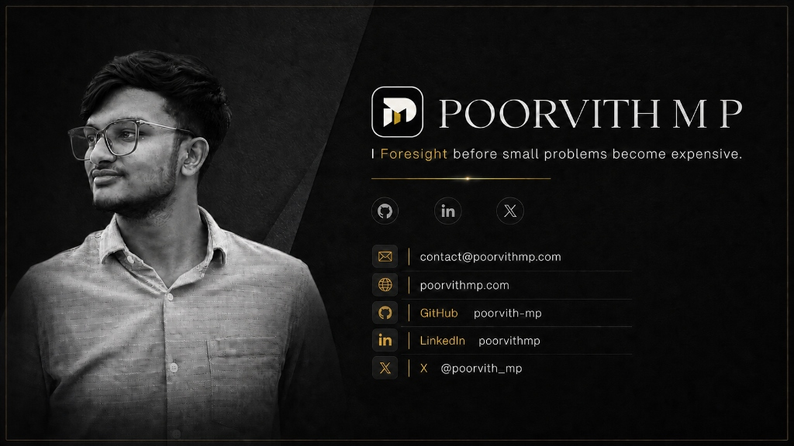

<div align="center">

<a href="https://www.poorvithmp.com">
  
</a>

<br/><br/>


# POORVITH M P

### <i>I Foresight before small problems become expensive.</i>

<p align="center">
  <strong>Student Developer • Tools Architect • AI Agent Systems • Local-First & Privacy Engineering</strong>
  <br/>
  <span>Karnataka, India</span>
</p>

<!-- Identity Action Badges -->
<p align="center">
  <a href="https://www.poorvithmp.com"></a>
  <a href="mailto:contact@poorvithmp.com"></a>
  <a href="https://linkedin.com/in/poorvithmp"></a>
  <a href="https://x.com/poorvith_mp"></a>
  <a href="https://github.com/poorvith-mp?tab=repositories"></a>
</p>

</div>

---

## 🏛️ About Me & The Foresight Principle

I notice the friction people learn to tolerate, turn it into a focused tool, and keep the engineering decisions visible from first check to working proof.

Most software failures do not happen because of complex math — they happen because small warning signs were ignored: a credential pasted into an LLM prompt, a missing environment variable crashing a dev container, or semester grade calculations lost in rigid spreadsheets. 

I build browser-local utilities, developer tools, and modular AI agent systems that solve these exact points of friction before they turn into costly emergencies.

<br/>

<table>
<tr>
<td width="25%" align="center">
  <strong>🛡️ Foresight First</strong><br/>
  <sub>Catching leaks, conflicts, and decay before staging or production</sub>
</td>
<td width="25%" align="center">
  <strong>🔒 Zero-Exposure Privacy</strong><br/>
  <sub>100% browser-local cryptography and offline-capable CLIs</sub>
</td>
<td width="25%" align="center">
  <strong>⚡ Useful Before Impressive</strong><br/>
  <sub>Sub-3-second runtimes, zero-config setups, and honest limits</sub>
</td>
<td width="25%" align="center">
  <strong>🔍 Visible Trade-Offs</strong><br/>
  <sub>Open documentation, verified benchmarks, and zero telemetry traps</sub>
</td>
</tr>
</table>

---

## ⚡ Instant Terminal Quick-Launch

Test my developer tools directly in your terminal in under 3 seconds without cloning or configuring dependencies:

```bash
# 1. Strip API keys, PII, and AI zero-width watermarks before sending prompts to LLMs
npx aiscrubber

# 2. Audit runtime versions, port conflicts, service daemons, and .env key parity
npx @envpreflight/cli

# 3. Install modular developer instructions into Claude Code, Codex, or Cursor
npx skills add poorvith-mp/skills-developer
```

---

## 🚀 Selected Products & Shipped Tools

<table width="100%">
<tr>
<td width="50%" valign="top">

<a href="https://aiscrubber.poorvithmp.com">
  
</a>

### 🔒 [AIScrubber](https://github.com/poorvith-mp/aiscrubber)
> **Zero-exposure browser privacy desk, CLI, and Model Context Protocol (MCP) server.**

- **The Problem:** Developers paste credentials, DB connection strings, and logs into ChatGPT/Claude. Once sent to frontier models or public issue trackers, a secret cannot be un-sent.
- **The Solution:** Operates 5 client-side engines: text credential scrubber (8 detector classes + regex), zero-exposure prompt roundtrip with `.aiscrub.json` reconstruction key, zero-width Unicode watermark remover, C2PA EXIF/metadata wiper, and canvas redactor.
- **Tech Stack:** React 19 · TypeScript · Web Crypto API · Vite · Tailwind CSS · MCP Server · Node CLI

<p>
  <a href="https://aiscrubber.poorvithmp.com"></a>
  <a href="https://github.com/poorvith-mp/aiscrubber"></a>
</p>

<details>
<summary><strong>View architectural highlights</strong></summary>

- 100% in-browser Web Crypto execution with zero network telemetry
- Claude & LLM invisible watermark remover (`\u200B`, `\u200C`, `\u200D`, `\uFEFF`, `\u2060`)
- Terminal batch execution via `npx aiscrubber`
- Native MCP server integration for Claude Desktop and Cursor

</details>

</td>
<td width="50%" valign="top">

<a href="https://github.com/poorvith-mp/envpreflight">
  
</a>

### 🛠️ [EnvPreflight](https://github.com/poorvith-mp/envpreflight)
> **Sub-3-second local runtime, service, and environment readiness auditor.**

- **The Problem:** New developers clone a project, run the build, and hit cryptic runtime version mismatches, missing `.env` variables, stopped Docker containers, or port collisions.
- **The Solution:** Automatically inspects project manifests (`.nvmrc`, `package.json`, `pyproject.toml`, `go.mod`, `docker-compose.yml`, `.env.example`) and generates single-line copyable fixes.
- **Tech Stack:** TypeScript · Node.js · pnpm Workspaces · tsup · Vitest · MCP Protocol · VS Code Extension

<p>
  <a href="https://github.com/poorvith-mp/envpreflight"></a>
  <a href="https://www.npmjs.com/package/@envpreflight/cli"></a>
</p>

<details>
<summary><strong>View architectural highlights</strong></summary>

- Multi-runtime validation for Node.js, Python, Go, and Rust
- Background daemon checks: Postgres (5432), Redis (6379), MySQL (3306), MongoDB (27017), Docker
- Strict zero-leakage `.env` variable key auditor (secret values are never read or logged)
- Model Context Protocol (MCP) server for Claude Code and Cursor agents

</details>

</td>
</tr>
<tr>
<td width="50%" valign="top">

<a href="https://safegen.poorvithmp.com">
  
</a>

### 🔑 [SafeGen](https://github.com/poorvith-mp/safegen)
> **Browser-local cryptographic credential, passphrase, and pattern generator.**

- **The Problem:** Online password generators transmit generated secrets across networks or rely on biased `Math.random()` pseudo-random implementations.
- **The Solution:** Uses browser `crypto.getRandomValues()` with rejection sampling to eliminate modulo bias. Provides 4 modes: Random Password, Memorable Passphrase, Numeric PIN, and Custom Pattern with live bit-entropy calculation.
- **Tech Stack:** React 19 · TypeScript · Web Crypto API · Vite · Tailwind CSS v4 · GSAP

<p>
  <a href="https://safegen.poorvithmp.com"></a>
  <a href="https://github.com/poorvith-mp/safegen"></a>
</p>

<details>
<summary><strong>View architectural highlights</strong></summary>

- Cryptographic randomness via Web Crypto API with zero server calls
- Live bit-entropy scoring and offline brute-force crack time models
- Local-only searchable copy desk up to 50 items with 1-click purge
- Fully responsive tactile interface with GSAP micro-interactions

</details>

</td>
<td width="50%" valign="top">

<a href="https://gradeforge.poorvithmp.com">
  
</a>

### 📊 [GradeForge](https://github.com/poorvith-mp/gradeforge)
> **Credit-weighted semester GPA engine & Target What-If degree planner.**

- **The Problem:** University grading scales vary widely. Ad-filled online calculators fail on custom credits, multi-semester weighting, and forward-looking GPA target forecasting.
- **The Solution:** Preloaded with university presets (VTU CBCS, Anna University, Mumbai University, KTU, JNTU, US 4.0) plus a custom scale builder. Includes a Target CGPA What-If planner calculating exact required semester GPAs.
- **Tech Stack:** React 18 · TypeScript · Vite · Tailwind CSS · LocalStorage Persistence

<p>
  <a href="https://gradeforge.poorvithmp.com"></a>
  <a href="https://github.com/poorvith-mp/gradeforge"></a>
</p>

<details>
<summary><strong>View architectural highlights</strong></summary>

- Multi-semester credit-weighted SGPA and cumulative CGPA calculation
- Target CGPA 'What-If' planner for future semester planning
- CSV data export, JSON backup, and clean printable transcript renderer
- 100% offline browser storage with zero account signups

</details>

</td>
</tr>
<tr>
<td colspan="2" valign="top">

<a href="https://skillary.poorvithmp.com">
  
</a>

### 🧠 [Skillary](https://github.com/poorvith-mp/skillary) — The Universal AI Agent Skills Ecosystem
> **315 modular agent instructions organized across 12 focused domain packages.**

- **The Problem:** Agent capabilities are often locked behind monolithic plugins or vague system prompts that lack deterministic operational rules.
- **The Solution:** A standardized repository index compatible with Claude Code, OpenAI Codex, Cursor, and Gemini CLI. Adheres to the official Agent Skills Specification with progressive execution, reference documentation, and domain checklists.
- **12 Domain Packages:** Developer · Marketing · Design · Business · Finance · Sales & Support · Education · Game Dev · Writing · Personal · Specialized · Meta
- **Installation:** Direct via Claude Code marketplace or terminal `npx skills add poorvith-mp/skills-[category]`.

<p>
  <a href="https://skillary.poorvithmp.com"></a>
  <a href="https://github.com/poorvith-mp/skillary"></a>
</p>

</td>
</tr>
</table>

<details>
<summary><strong>📚 Explore Additional Open Source Projects</strong></summary>
<br/>

- **[Open Privacy](https://github.com/poorvith-mp/open-privacy)** — Decision-first guide and curated evaluation matrix covering privacy tools across 25 categories.
- **[Interview Prep](https://github.com/poorvith-mp/interview-prep)** — Local technical interview coach built with Streamlit, Ollama, and local Mistral models.
- **[Personal Portfolio Theatre](https://github.com/poorvith-mp/poorvithmp)** — The source code powering [poorvithmp.com](https://www.poorvithmp.com), featuring the Platinum Product Theatre design system.

[Browse all 30+ repositories on GitHub &rarr;](https://github.com/poorvith-mp?tab=repositories)

</details>

---

## 🛠️ Technical Stack & Agent Architecture

I combine modern web standards with rigorous multi-agent workflows:

```
┌─────────────────────────────────────────────────────────────┐
│ 1. Claude Code: Chief Architect & Planner                   │
│    Deconstructs requirements into verifiable specifications │
└──────────────────────────────┬──────────────────────────────┘
                               ▼
┌─────────────────────────────────────────────────────────────┐
│ 2. Codex App: Builder & Implementer                         │
│    TDD execution, live local servers, minimal clean diffs   │
└──────────────────────────────┬──────────────────────────────┘
                               ▼
┌─────────────────────────────────────────────────────────────┐
│ 3. Antigravity / Gemini CLI: Security & Hardening           │
│    Secret preflight, edge verification, production releases │
└─────────────────────────────────────────────────────────────┘
```

<br/>

<div align="center">

### Core Technologies

| Layer | Technologies |
|---|---|
| **Languages & Runtimes** |     |
| **Frontend & UI Systems** |     |
| **Edge & Cryptography** |     |
| **AI Agent Ecosystem** |     |
| **Tooling & Quality** |     |

</div>

---

## 📈 Activity & Building in Public

<div align="center">

<picture>
  <source media="(prefers-color-scheme: dark)" srcset="https://raw.githubusercontent.com/poorvith-mp/poorvith-mp/output/contribution-snake-dark.svg"/>
  <source media="(prefers-color-scheme: light)" srcset="https://raw.githubusercontent.com/poorvith-mp/poorvith-mp/output/contribution-snake.svg"/>
  
</picture>

<br/><br/>

<!-- GitHub Stats & Streak Cards in Gold/Carbon Theme -->
<a href="https://github.com/poorvith-mp">
  
</a>
<a href="https://github.com/poorvith-mp">
  
</a>

<br/>

<a href="https://github.com/poorvith-mp">
  
</a>

</div>

---

## 🎓 Education & Journey

- **Schooling:** Jawahar Navodaya Vidyalaya (2018–2025)
- **Next Chapter:** Incoming B.Tech Computer Science & Engineering student
- **Current Focus:** Strengthening shipped tools, expanding modular agent skill architectures, and building local-first developer utilities.

---

## 🤝 Connect & Collaborate

I'm open to practical engineering collaborations, tools development, and discussing novel agent architectures.

<div align="center">

<a href="https://www.poorvithmp.com">
  
</a>

<br/><br/>

<a href="mailto:contact@poorvithmp.com"></a>
<a href="https://www.poorvithmp.com"></a>
<a href="https://linkedin.com/in/poorvithmp"></a>
<a href="https://x.com/poorvith_mp"></a>

<br/><br/>

<sub>Crafted with the Platinum Product Theatre aesthetic • Carbon `#08090b` & Champagne Gold `#cda03a`</sub>

</div>
